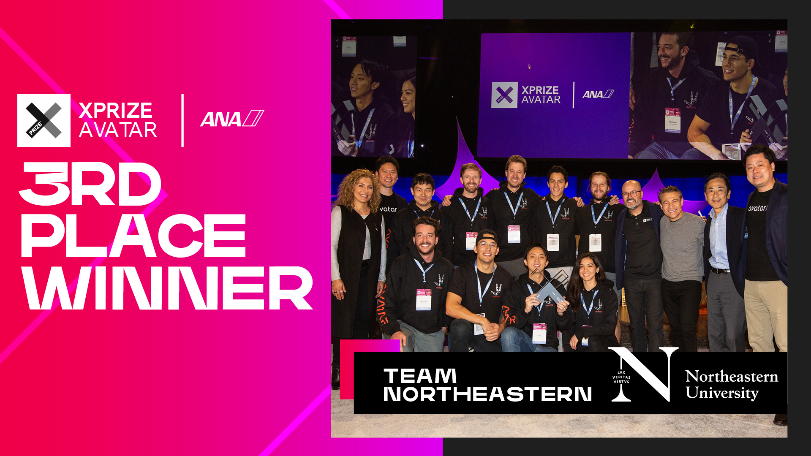
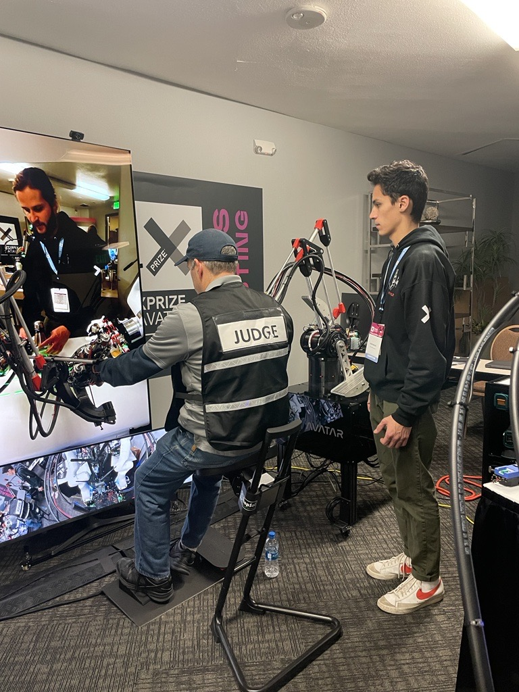

## Team Northeastern ANA Avatar XPRIZE



Our team went to the ANA Avatar XPRIZE Finals competition in November of 2022. There, we competed against 16 other teams from around the world to accomplish 10 tasks in an obsticle course using our telepresence robotic system. The team won 3rd place as the highest ranked U.S. team and with it $1 million. These avatar systems are a stepping stone to create the next generation of telepresence robotics for use in exploration, travel, and disaster releif.

The team built a majority of our avatar system from scratch using research developed over the past 5 years of the competition. The avatar (robot) side consists of two 7 DOF robot arms, two 3 DOF grippers, a custom frame to house the computers and motors, and an omnidirectional base for locomotion. On the operator side there is a large TV screen to see the view of the robot and two exoskeleton arms and gloves to feel your enviroment.

### Meet The Team Northeastern Avatar System

Our avatar features two custom designed 3 degree of freedom grippers that utilize a hydrostatic transmission for maximized stiffness and haptic sensing. The robot arms are controlled using an impedence controller that allows for backdrivability and safe operation. For perception, the robot uses a small cinema camera with a wide angle lens and laser projected depth queues. The base both powers the robot and provides locomotion for the system.

The operator can control the avatar using a set of exoskeleton arms that transmit position and orientation data to the robot. These arms also provide force feedback in 3 directions to help the user interact with their enviroment. To control the grippers, the operator wears two exoskeleton gloves which transmit force and haptic feedback to the user through an identical hydrostatic transmission.

To see the enviroment surrounding the avatar, the operator looks at two large monitors for manipulation and driving views. For driving, the operator tilts their foot on a omni-directional pad and the robot follows using its base. All together, the avatar can embody the operator and let them interact with the world.

#### Videos of the System in Action
[Interview with ABC Boston](https://northeastern.sharepoint.com/:v:/s/Avatar-Northeastern/ES-Jcg45hPhHpfAxU-RP3jcB3sL7gebNcBtvcbQzizZl-w?e=77otDi)

[System Overview](https://northeastern.sharepoint.com/:v:/s/InstituteforExperientialRoboticsPITeam2/EUDBxC84XmdGjitiSBpJ6TMBxIP7mxLdjHE4yA6_X04UZg?e=83VuUa)

[Avatar Competition](https://northeastern.sharepoint.com/:v:/s/InstituteforExperientialRoboticsPITeam2/EaY-Ilis6_dPot1P-jPFuOUB7zh-puYNnIc5UmB7B0ofww?e=NRK1jQ)

## The Team

### Advisors
Taşkın Padır |  Peter Whitney | Hanumant Singh
:-------------------------:|:-------------------------:|:-------------------------:
  |   | 

### PhD Students
- Chunpeng Wang
- Colin Keil
- Eric Schwarm
- Evelyn Mendoza
- Rui Luo

### Master Students
- Stephen Alt

### Undergraduate Students
- David Nguyen
- Henry Mayne

## Semi-Finals System
For the semi-finals competition in September of 2021, the team developed our first avatar system named Robalto. That system had the same purpose to transport a person's presence and is the team's first attempt at creating a system. The team competed in the ANA Avatar XPRIZE Semi-Finals competition and placed 3rd winning $130,000 for Finals development. 

Robalto consisted of a single robot arm with a lightweight pinser style gripper on the end using a similar hydrostatic transmission to the finals system. The base powered the robot along with providing mobility through its two large wheels. The frame housed the haptic motors and computers to control the robot.

To control Robalto, the operator wears an exoskeleton glove that transmits the forces of the gripper to your hand using another hydrostatic transmission. A kinematically identical exoskeleton is used to control the avatar's arm.

For viewing, the system used an array of cameras to provide visual information to the operator for driving, manipulation, and depth. A 3D mouse was used to control the mobile base of the robot.

