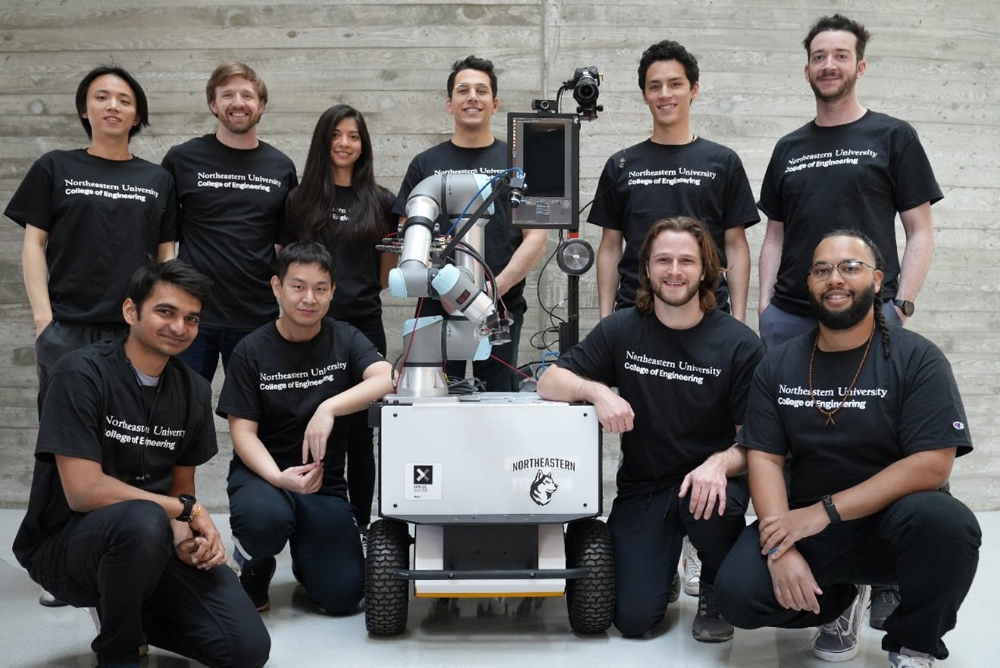
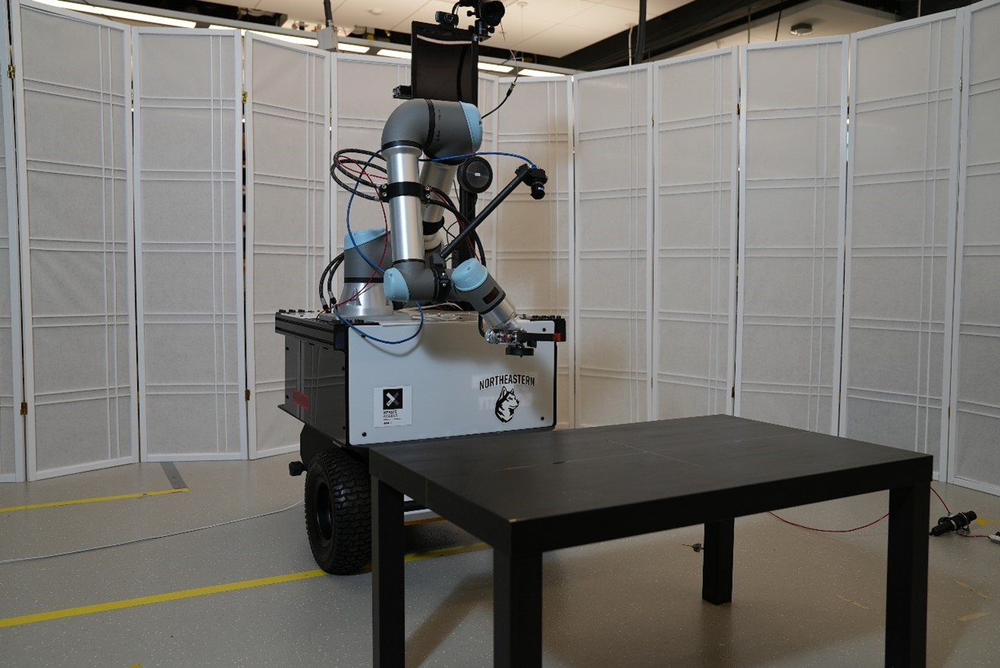
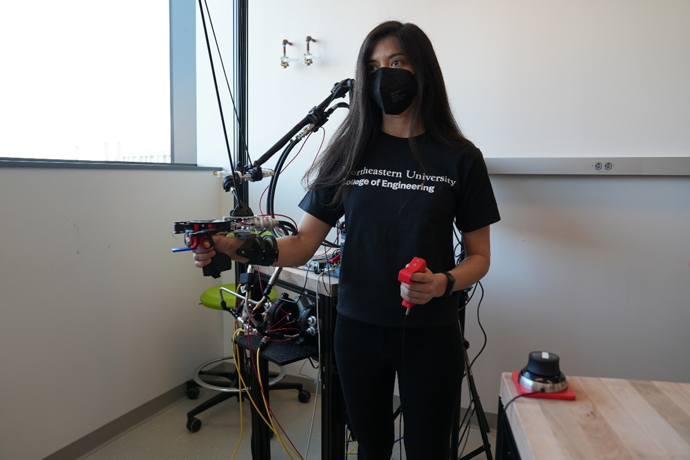
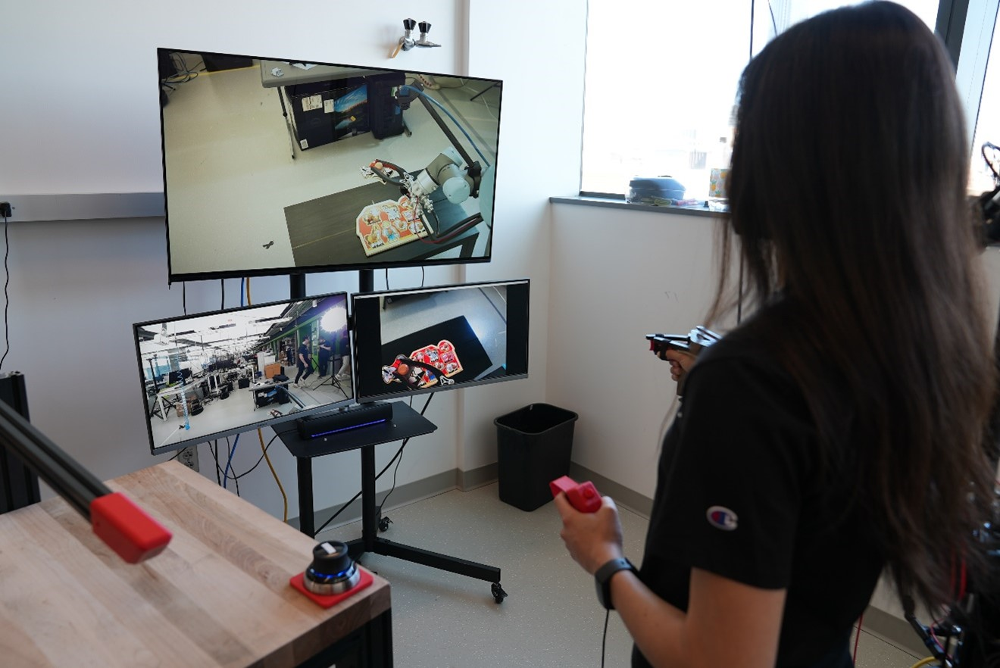
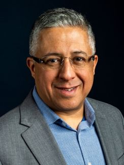
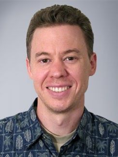
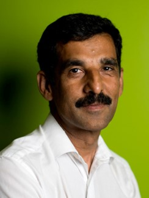

## Team Northeastern



Our team is one of twenty teams from twelve countries to be selected by the Avatar XPRIZE Judging Panel to advance to the Finals of the ANA Avatar XPRIZE competition. The team has built a mobile robot using a combination of originally designed hardware and re-engineered off the shelf robotic systems. The full system consists of a Husky UGV, Universal Robots UR5e, and an in-house designed/assembled hydraulic gripper and ultralight haptic glove.

### Meet Our Avatar System: Robalto

#### Videos of the System in Action
[Interview with ABC Boston](https://northeastern.sharepoint.com/:v:/s/Avatar-Northeastern/ES-Jcg45hPhHpfAxU-RP3jcB3sL7gebNcBtvcbQzizZl-w?e=77otDi)

[System Overview](https://northeastern.sharepoint.com/:v:/s/InstituteforExperientialRoboticsPITeam2/EUDBxC84XmdGjitiSBpJ6TMBxIP7mxLdjHE4yA6_X04UZg?e=83VuUa)

[Avatar Competition](https://northeastern.sharepoint.com/:v:/s/InstituteforExperientialRoboticsPITeam2/EaY-Ilis6_dPot1P-jPFuOUB7zh-puYNnIc5UmB7B0ofww?e=NRK1jQ)

## The Team

### Advisors
Taskin Padir |  Peter Whitney | Hanumant Singh
:-------------------------:|:-------------------------:|:-------------------------:
  |   | 

### PhD Students
- Aaron Essex
- Chunpeng Wang
- Colin Keil
- Eric Schwarm
- Evelyn Mendoza
- Rui Luo
- Tarik Kelestemur

### Master Students
- Ashray Kaup
- Stephen Alt

### Undergraduate Students
- David Nguyen
- Henry Mayne
- Nicolas Tan