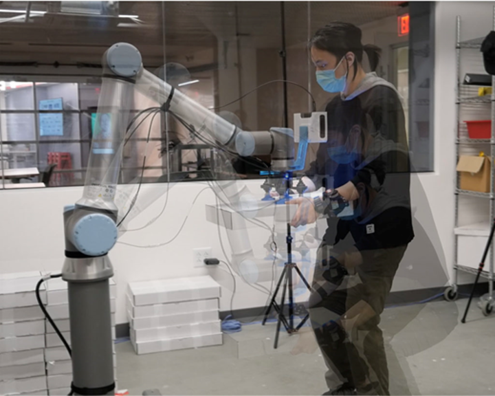

## [Gymnast Cobot](https://xdlab.camd.northeastern.edu/gymnast_cobot/)



A collaborative robot for industrial work environments that takes inspiration from fitness routines on gym machines for a physically more sustainable work modality. The system first considers the worker’s height and weight; by monitoring the worker’s movement metrics and heart rate, the robot autonomously adjusts its behavior to that of the human worker, thereby creating a seamless physical interaction to better support the worker. With gesture interaction, the human worker is also able to choose the exercise level as needed.

## Productive Inconvenience (Completed)

Collaborative robots that physically interact with humans in an ergonomic and safe manner are essential to the future of industry. A common task across many industrial applications is robot-to-human handover, in which the location of object exchange is vital in cultivating a seamless interaction. Most prior works focus on calculating an “optimal” handover point by minimizing a pre-defined cost function (e.g. REBA score) that measures the ergonomic level of human pose during handover. Although such methods might produce good results within one single handover, few of them have evaluated the performance over the long-time horizon. In this work, we proposed that stimulating behaviors from the robot might incur alertness of the human work and thus maintaining ergonomic posture by themselves more often in the long run. We conducted a within-subjects study where participants performed 78 objects handovers to compare two different human robot collaboration strategies and the results indicate an improvement in ergonomics scores for our “stimulating” approach, namely the “Productive Inconvenience”.

## Assistive Large Fish Handling (Ongoing)

Large fish processing such as tuna and swordfish, is one of the most challenging tasks in a seafood factory. From our interview with local seafood factories, it would take at least 1 year to train someone to be good at processing large fish.  Needless to say, we would not want to equip the robot with a knife or replace the human worker with an autonomous machine considering the complexity of the task. Our goal is to design customized hardware and software that can help with proficient workers in a variety of ways as well as facilitate the skill transferring for untrained workers.

### Soft Robot Material Sensing

Previous work in material sensing with soft robots has focused on integrating flexible force sensors or optical waveguides to infer object shape and mass from experimental data. We have designed a novel modular sensing platform integrated into a hybrid-manufactured soft robot gripper to collect and process high-fidelity spectral information. The custom design of the gripper is realized using 3D printing and casting. We embed full-spectrum light sources paired with lensed fiber optic cables within an optically clear gel, to collect multi-point spectral reflectivity curves in the Visible to Near Infrared (VNIR) segment of the electromagnetic spectrum. The integration of spectroscopic data presents a promising new sensing modality for soft robots to understand the material composition of grasped items, facilitating numerous applications for food-processing and manufacturing. Current work involves the design and manufacturing of multi-modal, electronic-free sensors.
