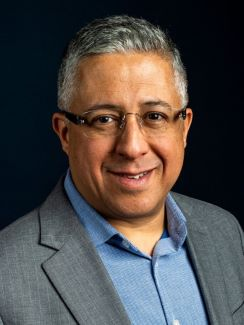
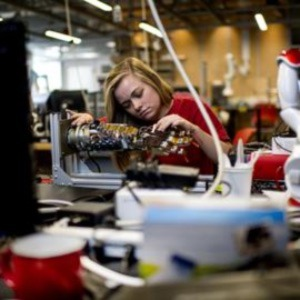
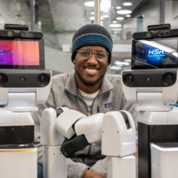
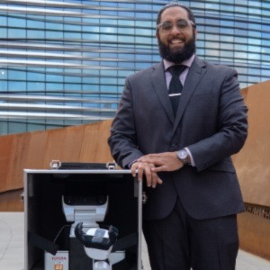
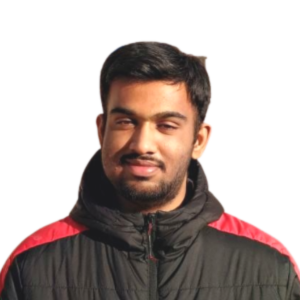
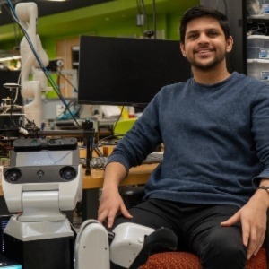
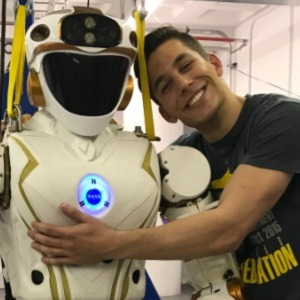
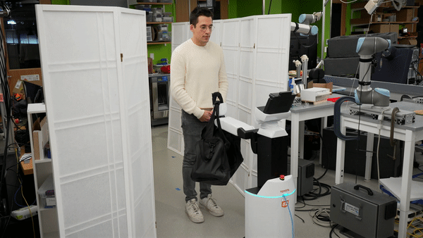
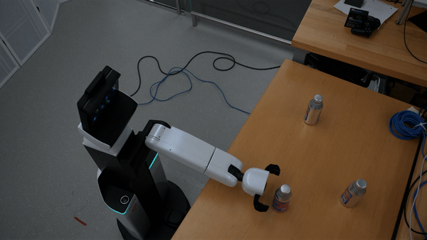

---
<h1 style="text-align: center;">The Team</h1>

---

<h2 style="text-align: center;">Advisor</h2>

<h4 style="text-align: center;">Taşkın Padır</h3>

## Team Members
Murphy Wonsick | James Tukpah |  Yousuf Khan 
|:----------------:|:----------------:|:----------------:|
  |  | 

Sarvesh Prajapati | Farhan Sarfraz | Stephen Alt
|:----------------:|:----------------:|:----------------:|
 |  | 

---

# FRASIER in Action

---



---

# Information

---

Frasier is Toyota’s Human Support Robot (HSR), a prototype research platform for service robots. It has been one of RIVeR lab’s main research tools in its line of robots. The RIVeR lab was one of the few US universities that were awarded the robot to participate in Robocup@Home and join a passionate group of researchers who wish to integrate robotics in a home environment. FRASIER stands for, Fostering Reslient Aging with Self-Efficacy and Independence Enabling Robot, which shows our commitment to developing robotic systems that foster resilient aging. In the past, Team Northeastern has succeeded through the use of classical techniques, this year's team will focus on applying learning based techniques to train HSR how to complete tasks. This will enable us to conduct research comparing the pros and cons of deploying classical and learning based techniques on standard robotic platforms, such as HSR.

---

# Previous Participation in RoboCup@Home

---
##### RoboCup@Home 2019: Sydney, Australia
At RoboCup@Home 2019, Team Northeastern was once again the best performing US team, and was invited to attend the 2020 World Robot Summit, where we placed 3rd.

###### RoboCup@Home 2018: Montreal, Canada
Our second Robocup@Home competition gave us with the opportunity to showcase our research in manipulation & perception. Team Northeastern placed 2nd in stage 1, and 4th in stage 2 & 3, receiving the “Best in Manipulation” Award. Team Northeastern was the best performing US team.

###### RoboCup@Home 2017: Nagoya, Japan
The RIVeR Lab’s Robocup@Home debut and first home robotics competition. Team Northeastern competed against 15 teams from all over the world. PhD student Tarik Kelestemur and Anas Abou Allaban tackled the “Storing Groceries” and “Speech & Person Recognition” tasks.

---

# Relevant Publications

---
[1] Tarik Kelestemur, Naoki Yokoyama, Joanne Truong, Anas Abou Allaban, and
Ta ̧skin Padir. System architecture for autonomous mobile manipulation of every-
day objects in domestic environments. In Proceedings of the 12th ACM Interna-
tional Conference on PErvasive Technologies Related to Assistive Environments,
PETRA ’19, page 264–269, New York, NY, USA, 2019. Association for Computing
Machinery.

[2] Aykut Özgün Önol, Philip Long, and Taşkın Padır. Contact-implicit trajectory
optimization based on a variable smooth contact model and successive convexifica-
tion. In 2019 IEEE International Conference on Robotics and Automation (ICRA).
IEEE, 2019.

[3] N. Ü. Akmandor and T. Padir, "A 3D Reactive Navigation Algorithm for Mobile Robots by Using Tentacle-Based Sampling," 2020 Fourth IEEE International Conference on Robotic Computing (IRC), Taichung, Taiwan, 2020, pp. 9-16, doi: 10.1109/IRC.2020.00009.

[4] M. Wang, R. Luo, A. Ö. Önol and T. Padir, "Affordance-Based Mobile Robot Navigation Among Movable Obstacles," 2020 IEEE/RSJ International Conference on Intelligent Robots and Systems (IROS), Las Vegas, NV, USA, 2020, pp. 2734-2740, doi: 10.1109/IROS45743.2020.9341337.

[5] A. Ö. Önol, R. Corcodel, P. Long and T. Padır, "Tuning-Free Contact-Implicit Trajectory Optimization," 2020 IEEE International Conference on Robotics and Automation (ICRA), Paris, France, 2020, pp. 1183-1189, doi: 10.1109/ICRA40945.2020.9196805.

[6] Abou Allaban, A.; Wang, M.; Padır, T. A Systematic Review of Robotics Research in Support of In-Home Care for Older Adults. Information 2020, 11, 75. https://doi.org/10.3390/info11020075 

[7] Mo Han, Sezen Yağmur Günay, İlkay Yildiz, Paolo Bonato, Cagdas D. Onal, Taşkin Padir, Gunar Schirner, and Deniz Erdoğmuş. 2019. From hand-perspective visual information to grasp type probabilities: deep learning via ranking labels. In Proceedings of the 12th ACM International Conference on PErvasive Technologies Related to Assistive Environments (PETRA '19). Association for Computing Machinery, New York, NY, USA, 256–263. https://doi.org/10.1145/3316782.3316794

[8] Tarik Keleştemur, Naoki Yokoyama, Joanne Truong, Anas Abou Allaban, and Taşkin Padir. 2019. System architecture for autonomous mobile manipulation of everyday objects in domestic environments. In Proceedings of the 12th ACM International Conference on PErvasive Technologies Related to Assistive Environments (PETRA '19). Association for Computing Machinery, New York, NY, USA, 264–269. https://doi.org/10.1145/3316782.3316797

[9] P. Long, M. Wonsick and T. Padir, "A Risk Informed Task Planning Framework for Humanoid Robots in Hazardous Environments," 2018 IEEE-RAS 18th International Conference on Humanoid Robots (Humanoids), Beijing, China, 2018, pp. 139-144, doi: 10.1109/HUMANOIDS.2018.8625061.

[10] Padir, T. (March 1, 2018). "Towards Realizing Practical Humanoid Robots One Challenge at a Time." ASME. Mechanical Engineering. March 2018; 140(03): S18–S23. https://doi.org/10.1115/1.2018-MAR-6

---

## GitHub
[Team Northeastern's 2023 RoboCup@Home GitHub Repository](https://github.com/RIVeR-Lab)

---

