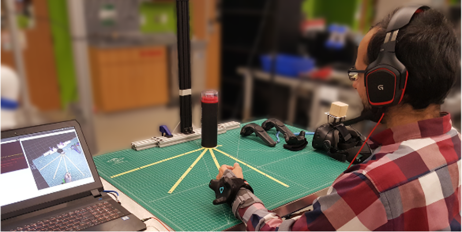

## Overview

This project explores human and robotic perception, behavior, and intent inference in a bidirectional and integrated manner within the context of object handover. Three specific aims are planned. The first uses motion capture, eye tracking, and electroencephalography data to build models of human intent and action during object handover. A novelty of the models is that they are sensitive to an individual's role (giver vs. receiver; leader vs. follower), to the presence or absence of communicative gaze, and to the degree of predictability of certain aspects of handover, such as grasp type, locus of handover, gaze conditions, and dyadic role. The second aim will develop a real-time intent inference engine that uses recursive Bayesian state estimation to obtain a probabilistic assessment of human intent as the handover action evolves in time. The output of this model will inform the robot's trajectory planner, thereby enabling it to make short time horizon predictions of human actions and to adjust robot motion plans accordingly in real-time. The third aim will examine how specific choices in the high-level planning and low-level control of robot motion impact human inference of robotic intent and action during object handover. If successful, this project will advance understanding of robot manipulation during human-robot handover and yield algorithms for achieving advanced autonomy during human collaboration with humanoid robots.

