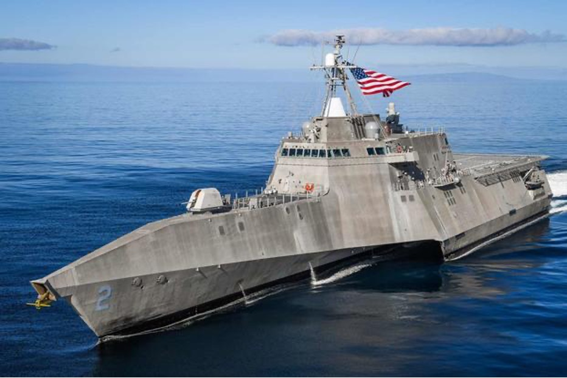

## Overview

The U.S. Navy is actively working to regain (and surpass) a robust level of battle-readiness skills including the ability to assess and prioritize a ship’s battle damage in real time. The Navy aims to leverage this assessment capability to proactively plan and conduct repairs, preferably while the ship is still at sea, thereby maximizing the percentage of fleet assets that are on-station and battle-ready. For this on-going project, the RIVeR Lab is developing an Integrated Battle Damage Assessment Tool (IBDAT)—internally code-named NIMOY—to collect data from shipboard sensors, both static and robotic, and use it to generate and visualize predictive analytics for automated damage assessment of active Navy vessels in a user-friendly interface.

