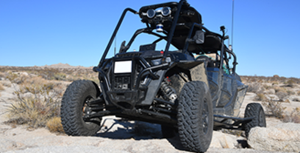
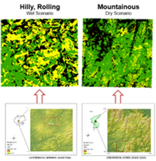

## Overview

The Nato-Reference Mobility Model (NRMM) is a physics-based vehicle-terrain prediction system. It is mostly a text-based code system developed in Fortran, which was originally designed in the mainframe era. This code suite was most recently updated in 2021, allowing for it to more accurately perform the function it was designed for, the standardization of vehicle performance in terms of mobility. Through a collection of equations and algorithms the system is meant to simulate cross-country movement of vehicles. The system models a vehicle's interaction with various terrains and various components of those terrains. It cares about interactions with soil strength, tree stems of various sizes and spacing, approach angles into ditches and streams, and etc. The system is most interested in determining the maximum potential speed of a given vehicle through a specified region. The purpose of this project is to take this currently developed system and design additional submodules for the purpose of accommodating more advanced levels of technology and automation.

