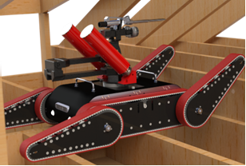



## Overview

For air-sealing in attic crawlspaces, a robot should be able to access most of typical narrow locations in the attic crawlspace, carry the tools required for air-sealing (spray gun, sealant can), and precisely apply spray foam sealant to the locations to be sealed. It should be noted that a drone cannot do the job due to the limited payload, and legged robot is not efficient in an attic crawlspace as it needs to grab and hold joists to navigate the attic crawlspace, without touching the ceiling and existing insulations. Our team has built PARIS (Precise Air sealing Robot for Inaccessible Spaces).

Our platform is founded upon a general-purpose multi-track robotic platform. Its flippers are designed to navigate extreme terrains, in both indoor and outdoor environments. PARIS 1.0 is built upon Robot Operating System (ROS) as the middleware that allows a high-level of flexibility and customizability by connecting various sensors and deploying state-of-the-art algorithms. ROS also allows wireless communications via a custom application on a mobile device, which is then used to communicate with human workers

PARIS’s highly maneuverable multi-track driving system with flippers allows it to traverse over joists and/or uneven surfaces. By controlling its flipper angles, PARIS 1.0 traverse uneven terrains and joists, and easily climbs up 45° inclines. On top of its great mobility, it has a max payload of 88 lbs., allowing it to carry tools and materials for air-sealing.

PARIS’ small footprint and driving system makes it a less invasive solution than traditional (human-only) air-sealing efforts, since it minimizes incidental damage like additional holes/cuts for human access. Its light weight also minimizes mess/potential damage to the property when it navigates the attic crawlspace. Learn more about PARIS and our submission to the Department of Energy E-Robot challenge in this short video.
